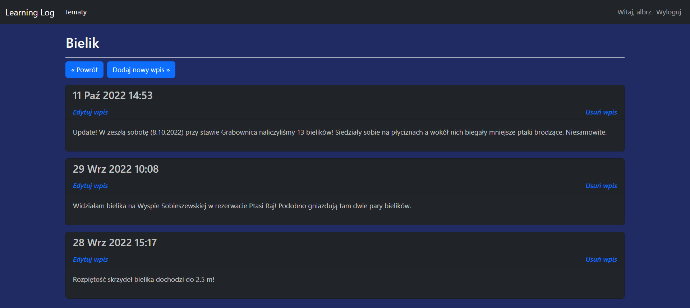

# Learning Log

The project represents a notebook application. It uses SQLite database. On October 28th, 2022 it was deployed on Heroku, but since November 28th, 2022 Heroku doesn't support free databases and it's no longer available.

On the start screen there is an option to *register* and *login* to the application. User has to register to use the application.

The registered user can *add* new topics and new entries related to the topics, *edit* and *delete* them. 

## Features

- **Registration** (function-based view in "users" app: *register*),
- **Login** (Django built-in authentication system),
- **CRUD operations** (function-based views in "learning_logs" app: *new_topic*, *new_entry*, *topic*, *topics*, *edit_entry*, *delete_topic*, *delete_entry*),
- **Two Django models** (classes: *Topic*, *Entry*),
- **All templates modified with Bootstrap 5**.
